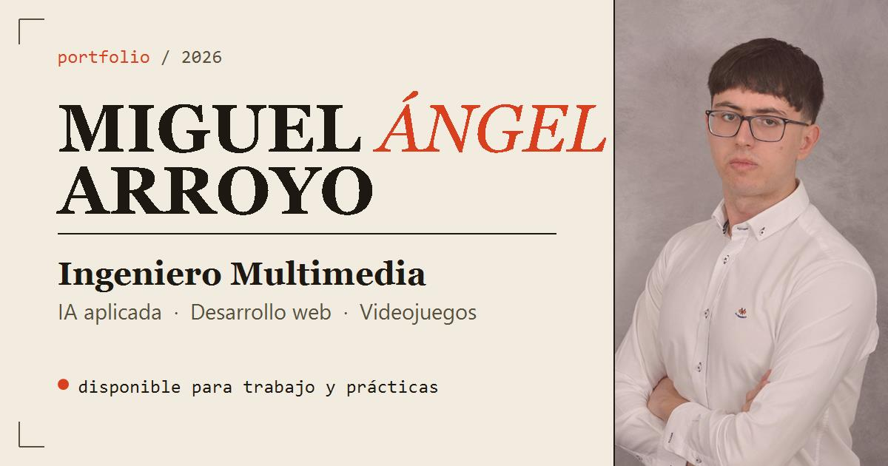

# maar.11 — Portfolio

Portfolio personal de **Miguel Ángel Arroyo Romero de Ávila**, Ingeniero Multimedia
especializado en IA aplicada, desarrollo web y videojuegos.

**→ [maar11-dev.github.io/maar11](https://maar11-dev.github.io/maar11/)**



## Qué hay dentro

| Sección | Contenido |
| --- | --- |
| Sobre mí | Contexto profesional y enfoque de trabajo |
| Experiencia | Prácticas de Ingeniería de Datos e IA en InferIA |
| Proyectos | IA aplicada (TFG, m.ai), web (RenderBox) y videojuegos (Dopamine Chasers, Preflop, TRAMFIGHT) |
| Habilidades | Stack técnico por áreas |
| Contacto | Email, LinkedIn, GitHub y CV |

## Stack

HTML, CSS y JavaScript sin dependencias ni paso de compilación. Se sirve tal cual
desde GitHub Pages.

- **Tipografías:** Fraunces (títulos), Archivo (texto), IBM Plex Mono (datos)
- **Temas:** claro y oscuro, con la preferencia guardada en `localStorage` y aplicada
  antes del primer pintado para evitar parpadeo
- **Idiomas:** español e inglés; el español vive en el HTML y las traducciones en
  `js/main.js`, enlazadas por atributos `data-i18n`
- **Animaciones:** aparición al hacer scroll con `IntersectionObserver`, respetando
  `prefers-reduced-motion`

## Estructura

```
index.html          Todo el contenido y las traducciones al español
css/styles.css      Estilos, tokens de color y responsive
js/main.js          Tema, idioma, menú móvil y animaciones de entrada
images/             Capturas de proyectos, logos y portada para compartir
```

## Desarrollo

No hace falta instalar nada. Para verlo en local con rutas absolutas correctas:

```bash
python -m http.server 8000
```

Y abrir <http://localhost:8000>.

Añadiendo `?capture` a la URL se desactivan las animaciones de entrada, útil para
hacer capturas de pantalla.
